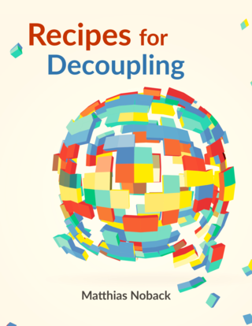

# PHPStan rules from the book "Recipes for Decoupling" by Matthias Noback

In the book ["Recipes for Decoupling"](https://leanpub.com/recipes-for-decoupling/) we discuss how to decouple from web and CLI frameworks, ORMs, validation libraries, and test frameworks. While doing so, we develop a number of custom rules for use with PHPStan. That way we can use automated static analysis to keep our code decoupled in the long run. 

This project contains all the final versions of each of the rules from the book. They are not production-ready but feel free to use them as a starting point for your own custom rules.

